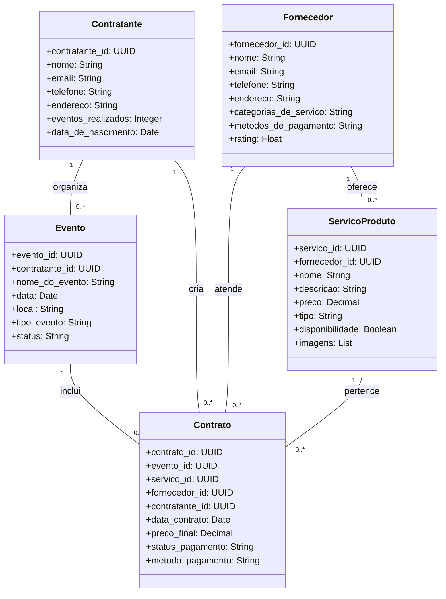

# Diagrama de Classes - WeParty

Este diagrama representa a estrutura das classes para o projeto WeParty.

```mermaid
classDiagram
    %% Definindo as classes
    class Fornecedor {
        +fornecedor_id: UUID
        +nome: String
        +email: String
        +telefone: String
        +endereco: String
        +categorias_de_servico: String
        +metodos_de_pagamento: String
        +rating: Float
    }

    class ServicoProduto {
        +servico_id: UUID
        +fornecedor_id: UUID
        +nome: String
        +descricao: String
        +preco: Decimal
        +tipo: String
        +disponibilidade: Boolean
        +imagens: List<String>
    }

    class Contratante {
        +contratante_id: UUID
        +nome: String
        +email: String
        +telefone: String
        +endereco: String
        +eventos_realizados: Integer
        +data_de_nascimento: Date
    }

    class Evento {
        +evento_id: UUID
        +contratante_id: UUID
        +nome_do_evento: String
        +data: Date
        +local: String
        +tipo_evento: String
        +status: String
    }

    class Contrato {
        +contrato_id: UUID
        +evento_id: UUID
        +servico_id: UUID
        +fornecedor_id: UUID
        +contratante_id: UUID
        +data_contrato: Date
        +preco_final: Decimal
        +status_pagamento: String
        +metodo_pagamento: String
    }

    %% Definindo relações entre as classes
    Fornecedor "1" -- "0..*" ServicoProduto : oferece
    Contratante "1" -- "0..*" Evento : organiza
    Evento "1" -- "0..*" Contrato : inclui
    Contratante "1" -- "0..*" Contrato : cria
    Fornecedor "1" -- "0..*" Contrato : atende
    ServicoProduto "1" -- "0..*" Contrato : pertence
```